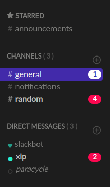
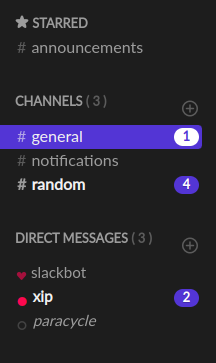

</a>

Two elegant Slack themes based on our Official <a href="https://www.barrage.net" target="_blank">Barrage</a> Color Pallete.

Folly             |  Iris
:-------------------------:|:-------------------------:
!
  |  

## Quick Start

In order to install a Slack theme, you need to follow these certain steps:

1. Sign in to the desired Slack workspace
2. Open Slack and navigate to the **Preferences** (<kbd>Ctrl</kbd>/<kbd>⌘</kbd>+<kbd>,</kbd>)
3. Go to the **Themes** section and find the **Custom Theme** section with the input containing the HEX colors
4. Paste the colors of your desired theme

<strong>Folly:</strong>

<code>#1d1d1d,#121016,#422aaa,#f1f1f1,#7057dc,#bcbcb8,#28f0d0,#fc0850,#1d1d1d,#bcbcb8</code>

<strong>Iris:</strong>

<code>#1d1d1d,#121016,#5335d5,#f1f1f1,#322080,#f1f1f1,#fc0850,#5335d5,#1d1d1d,#f1f1f1</code>

